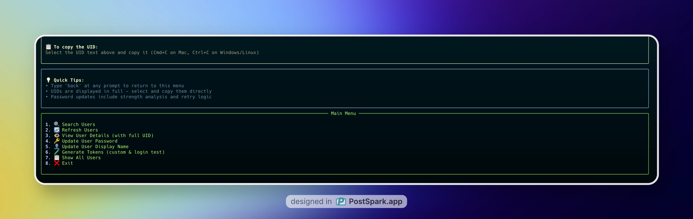

# 🔥 Firebase Admin Console

A beautiful CLI application for managing Firebase users with a modern terminal interface.



## Features

- 🔍 **Search Users**: Search by name or email
- 📋 **View All Users**: Display all users in a formatted table
- 🔑 **Reset Passwords**: Update user passwords securely
- 👤 **Update Names**: Change user display names
- 🎨 **Beautiful UI**: Modern terminal interface with colors and formatting
- ⚡ **Fast Loading**: Efficient user loading and caching

## Quick Start

### 🚀 Automated Setup (Recommended)

The easiest way to get started is using our setup script:

```bash
# Clone the repository
git clone <your-repo-url>
cd firebase_auth_python_console

# Run the setup script (handles everything automatically)
./setup.sh
```

The setup script will:
- ✅ Check Python version compatibility
- ✅ Create and activate virtual environment
- ✅ Install all dependencies (fixes externally-managed-environment error)
- ✅ Guide you through Firebase configuration
- ✅ Validate your Firebase admin key
- ✅ Launch the application

### 📋 Manual Setup

If you prefer manual setup:

#### 1. Clone the Repository
```bash
git clone <your-repo-url>
cd firebase_auth_python_console
```

#### 2. Create Virtual Environment
```bash
python3 -m venv venv
source venv/bin/activate  # On Windows: venv\Scripts\activate
```

#### 3. Install Dependencies
```bash
pip install -r requirements.txt
```

#### 4. Setup Firebase Admin Key
```bash
# Create a config directory for your Firebase admin key
mkdir config
# Move your Firebase admin JSON file to the config directory
mv your-firebase-admin-key.json config/firebase-admin-key.json
```

#### 5. Run the Application
```bash
python app.py config/firebase-admin-key.json
```

## Installation

1. Clone or download this repository
2. Install dependencies:
   ```bash
   pip install -r requirements.txt
   ```

## Setup

1. **Get Firebase Admin Key**:
   - Go to your Firebase Console
   - Navigate to Project Settings > Service Accounts
   - Click "Generate new private key"
   - Download the JSON file

2. **Run the Application**:
   ```bash
   python app.py path/to/your/firebase-admin-key.json
   ```

## Usage

### Starting the Application
```bash
python app.py ./firebase-admin-key.json
```

### Main Menu Options

1. **🔍 Search Users** - Search users by name or email
2. **🔄 Refresh Users** - Reload all users from Firebase
3. **👁️ View User Details** - View detailed user info with full UID display
4. **🔑 Update User Password** - Reset a user's password
5. **👤 Update User Display Name** - Change a user's display name
6. **🧪 Generate Tokens** - Generate custom tokens or test login
7. **📋 Show All Users** - Display all users in a table
8. **❌ Exit** - Close the application

### UID Copying Features

- **Full UID Display**: UIDs are shown completely without truncation
- **Easy Selection**: UIDs are displayed in bold cyan for easy identification
- **Copy Instructions**: Detailed view includes copy instructions
- **Table Selection**: You can select and copy UIDs directly from the user table

### Token Generation Features

- **Custom Token Generation**: Generate Firebase custom tokens using Admin SDK (no API key needed)
- **Password Login Testing**: Test user authentication with email/password (requires Web API key)
- **Token Display**: View and copy both custom tokens and ID tokens
- **Multiple Methods**: Choose between Admin SDK or REST API approaches
- **Error Handling**: Clear error messages for failed token generation
- **User Verification**: Shows user details before token generation

### Example Workflow

1. Start the app with your Firebase admin JSON
2. The app will automatically load all users
3. Use the search function to find specific users
4. Select a user by UID to update their information
5. Confirm changes before applying them

## Requirements

- Python 3.7+
- Firebase project with Authentication enabled
- Firebase Admin SDK service account key

## Dependencies

- `firebase-admin` - Firebase Admin SDK
- `rich` - Beautiful terminal formatting
- `click` - Command line interface
- `colorama` - Cross-platform colored terminal text

## Project Structure

```
firebase_auth_python_console/
├── app.py                 # Main application entry point
├── firebase_service.py    # Firebase service layer
├── cli_interface.py       # Terminal UI interface
├── example.py             # Example usage script
├── setup.sh               # Automated setup script
├── requirements.txt       # Python dependencies
├── README.md             # This file
├── .gitignore            # Git ignore rules
├── venv/                 # Virtual environment (created by setup.sh)
└── config/               # Configuration folder (ignored by Git)
    └── firebase-admin-key.json  # Your Firebase admin key
```

## Security Notes

- Keep your Firebase admin JSON file secure
- Never commit the admin JSON file to version control
- The application handles password input securely (hidden input)
- The `config/` folder is automatically ignored by Git

## Setup Script Options

The `setup.sh` script provides several options:

```bash
# Show help
./setup.sh --help

# Only setup environment, don't run the app
./setup.sh --setup-only

# Skip setup and run the app directly (if already set up)
./setup.sh --run-only

# Force recreate virtual environment
./setup.sh --recreate-venv
```

### Troubleshooting Setup Issues

**Externally-managed-environment Error:**
- ✅ **Fixed automatically** by the setup script using virtual environments
- The script creates an isolated Python environment to avoid system conflicts

**Missing Dependencies:**
- ✅ **Handled automatically** by the setup script
- All required packages are installed in the virtual environment

**Firebase Configuration:**
- ✅ **Guided setup** - the script will prompt you for your Firebase admin key
- ✅ **Validation** - checks that your key file is valid JSON with required fields

## Git Setup

This project is already initialized as a Git repository. Here's how to set it up:

### Initial Setup
```bash
# The repository is already initialized
git status
```

### Adding Files
```bash
# Add all files (config folder will be ignored)
git add .

# Commit your changes
git commit -m "Initial commit: Firebase Admin Console"
```

### Remote Repository
```bash
# Add your remote repository
git remote add origin <your-repo-url>

# Push to remote
git push -u origin main
```

### Important Notes
- The `config/` folder is automatically ignored by Git
- Firebase admin JSON files are ignored for security
- Python cache files and virtual environments are ignored
- IDE and OS-specific files are ignored

## License

This project is open source and available under the MIT License.
